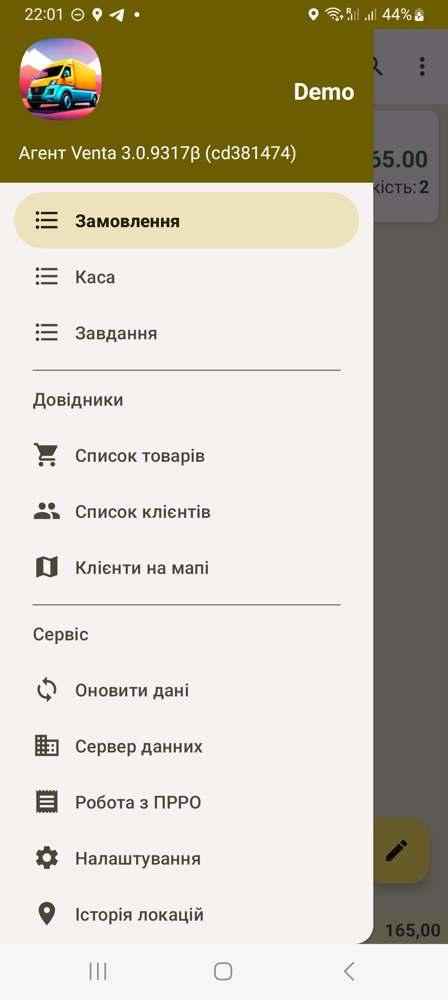

 
# AgentVenta
Програма для автоматизації роботи торгових агентів на маршруті. Дозволяє приймати замовлення від покупців і швидко передавати їх в облікову систему - 1С або іншу. Крім прийому замовлень можна оформити повернення товарів і прийом оплати від клієнта. 

Основні функції додатка:
- перегляд довідника товарів з даними про залишки та ціни
- зображення товарів
- перегляд довідника клієнтів з даними про адресу, телефон, сальдо взаєморозрахунків, останні операції
- введення замовлення клієнта і відправка документа в облікову систему
- введення касового ордера і відправка його в облікову систему
- запис історії локацій з переглядом на мапі, з підрахунком відстані за день
- перегляд клієнтів на мапі
- оформлення фіскальних чеків через ПРРО (підтримується CheckBox)
- підключення принтера для друку чеків та замовлень через Bluetooth
- підключення сканера штрих-кодів для швидкого введення товарів

Состав вигрузки налаштовується на стороні облікової системи і може бути обмежений в залежності від необхідного доступа користувача, або взагалі для мобільних користувачів.

Опис основних елементів інтерфейсу та функцій доступний за посиланням: https://programmer.com.ua/android/agent-user-manual/

Для ознайомлення можливо налаштування тестового з'єднання - в адресу сервера впішіть demo, ім'я бази також вкажіть demo.
В демонстраційному режимі додаток обмінюється з базою 1С, яку можна побачити через веб-інтерфейс за адресою: http://hoot.com.ua/simple 
Для входу в веб-інтерфейс оберіть ім'я Пользователь, без паролю.
